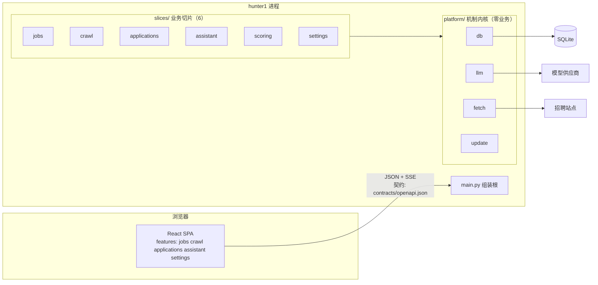

# 架构

> Hunter1 v2 —— Agent-Native 全栈架构。
> 本文是**决策记录**：不只说「是什么」，还说明「为什么这样、代价是什么」。

## 一句话

**后端是切片化的纯 API，前端是独立的 SPA，两者只经 OpenAPI 契约对话；
开发期完全分离，交付期聚合成单目录。**

## 三条设计公理

其余所有设计都从这三条导出。改动架构时先问：是否与公理冲突？

### 公理 1 · 契约先行（Contract First）

跨端只经由显式契约。后端 Pydantic 模型是**唯一事实来源**，`contracts/openapi.json`
是机器生成的快照，前端类型由它生成（禁手改）。漂移由门禁红灯拦住，不靠人自觉。

**代价与取舍**：契约快照入库会产生 diff 噪音（每次改 API 都要提交一个 JSON）。
这是**故意的** —— 契约变更必须可见、可审、可回滚。

### 公理 2 · 切片即领地（Slice as Territory）

业务代码按能力垂直切分，每切片自含 `router / schemas / service / store / SLICE.md`。
切片间只经**公开面**（`__init__.py`）引用，依赖方向固定且无环。

**为什么要这样切**（不只是"好看"）：

1. **文件所有权互斥** → 多个 Agent 可以并行改不同切片而零冲突（Wave 4 的实测：
   5 个切片并行/串行迁移，跨切片冲突数为 0）；
2. **验证可局部化** → `pytest tests/slices/<name>` 是该切片的独立验证命令，
   Agent 不必理解全仓库；
3. **认知对称** → 前端 `features/` 与后端 `slices/` **同名**，看任一边能推断另一边。

**协议（Protocol）只保留给进程边界**（LLM、HTTP）。进程内的切片间不再需要抽象层 ——
抽象层本身就是认知负担，而切片边界已经提供了隔离。

### 公理 3 · 双形态交付（Two-Mode Delivery）

同一份代码有两种运行形态：

| 形态 | 前端 | 后端 | 用途 |
|---|---|---|---|
| 开发 | Vite（:5173，proxy /api） | uvicorn（:8000） | 双进程，各自热重载 |
| 交付 | 构建产物由后端服务 | 同进程 | 单目录，双击即用 |

用分布式架构开发，用单体架构交付。请求路径在两种形态下**完全一致**
（都是 `/api/*`），因此业务代码零分支。

## 全景

## 依赖方向（编译期钉死）

`tests/test_architecture.py` 逐条断言，越权即红灯：

| 层 | 允许依赖 | 说明 |
|---|---|---|
| `platform` | 无业务 | 机制内核：db / llm / fetch / update / text |
| `slices` | platform、domain、`application.ports` | 业务切片；切片间只经公开面，禁深链 |
| `domain` | 仅 `platform.text` | 共享模型（过渡期，见下） |
| `application` | domain | 端口协议（进程边界） |
| `main.py` | 全部 | **唯一**认识所有切片的地方 |

**不得存在**：`web/`（旧 SSR 层已删，有断言钉死）。

## 切片地图

| 切片 | 职责 | 依赖 |
|---|---|---|
| `jobs` | 岗位与公司的事实、查询、投递入口 | platform |
| `crawl` | 抓取编排 + 站点注册表 + 进度运行器 | platform, ports |
| `applications` | 投递记录（岗位的快照语义） | platform |
| `assistant` | agent 循环 + 工具协议 + 会话 | platform, ports |
| `scoring` | 匹配评分（**提示词与代码共置**） | platform, ports |
| `settings` | LLM 配置读写与连通探测 | platform |

## 面向模型增长的三个设计

模型能力会持续变强，架构必须让它变成「改配置/改提示词」而不是「重写管线」：

1. **LLM 只作为端口出现**（`application/ports.py` 的 `LLMProvider`）——
   换厂商不改任何切片代码；
2. **提示词与代码共置**（`slices/scoring/prompts.py`）—— 口径升级只动一个文件，
   且带 `PROMPT_VERSION` 可回溯「这条分是哪版打的」；
3. **能力降级显式化**（`structured_mode`：json_schema → json_object → text）——
   新模型支持更强能力时是**增加一档**，不是改调用方。

`slices/scoring/SLICE.md` 里有完整的「模型换代规程」。

## 双形态交付的实现要点

- **契约与类型**：`scripts/contracts.sh`（导出 + `--check` 漂移门禁）。
  生成器跑在 `frontend/tools/contract-codegen` 的**独立依赖树**里
  （openapi-typescript 的 peer 限 TS5，主工程用 TS7 —— 生成器只产出 `.d.ts` 文本，
  两边编译器版本互不影响）。
- **SPA 回落**：`main.py` 在 API 路由**之后**注册 `/api/*` 之外的兜底路由，返回
  `index.html`（前端路由自己解析路径）。顺序反了会把 API 吞掉。
- **产物缺失时**：给 503 + 可行动提示（`hint` 里写明怎么构建），而不是 500 或白屏。
- **打包**：`hunter1.spec` 把 `frontend/dist` 嵌到 `hunter1/web_dist`；
  `main.frontend_dir()` 在打包态从 `sys._MEIPASS` 找它。

## 已知取舍与技术债（诚实记录）

1. **`domain/` 是过渡期的共享模型层**。终态应把 `Job` 归 `slices/jobs`、
   `Message/Role/ToolCall` 归 `platform/llm`（它们描述的是模型消息协议）。
   现在保留是因为 `platform/db` 与 `platform/llm` 都要用 —— 归位切片会让
   platform 反向依赖 slices。已在各 `SLICE.md` 记录。
2. **`application/` 只剩两个模块**（`ports.py` + `applications.py`，有架构测试钉死）。
   原先这里住着 `assistant / crawl / job_tools / tools / score` 五个模块 —— 它们是
   `slices/` 对应实现的**逐字拷贝**（差异仅 import 前缀 2~4 行），生产代码 0 引用，
   却各带一套测试（105 项）。已随本次清理删除，`examples/` 改指生产路径。

   为什么必须删：一是 840 行死代码会与 `slices/` **漂移** —— 改一边忘另一边，
   两套测试都绿、只有一套在生产跑；二是那 105 项「绿」不证明任何生产行为，
   是**假信心**（验证矩阵因此从 772 降到 668，降的是冗余不是覆盖）。
   `crawlers/` 的删除同理，两者都有存在性断言防止复活。
   ⚠️ `slices/jobs/service.py` 仍经 `application.applications` 取 `new_application`
   （登记在 `SLICE_LEGACY_ALLOW`）。**不能**直接改指 `slices.applications`：那会引入
   `jobs → applications` 反向依赖（白名单是 `applications → jobs` 单向）。清理前需先
   决定「投递」这一动作归属哪个切片。
3. **`application/ports.py` 是共享协议模块**（架构测试显式豁免）。
   它是进程边界的抽象，不属于任何切片 —— 但位置不理想（在 `application` 包下）。
4. **无 no-JS 回退**：SPA 的取舍。旧 SSR 版本有表单回退，v2 放弃。
5. **SSE 进度未做**：抓取进度仍是轮询（与旧界面语义一致）。
6. ~~**candidate_profile 未持久化**~~ —— **已解决**（画像可配置 + 评分端点始终挂载）。
   原描述为：「画像由组装处注入，编辑界面待做；未提供时 scoring 端点不挂载
   （「没接线」表现为「端点不存在」）」。这条记录的问题比描述更严重：画像
   **从来没有**生产入口（`cli.py` 不注入），所以成品里评分根本不可达，而契约
   快照却声称它有 —— 前端照契约写会拿到 405（SPA 回落的 GET 拦下了 POST）。
   现画像存库、`GET/PUT /api/scoring/profile` 可读写、未配置时给 409 + 指引。
   教训：**「端点不存在」不是一种诚实的失败**——它让契约与运行时静默分叉。

## 验证矩阵

| 层 | 命令 | 覆盖 |
|---|---|---|
| 后端全量 | `cd backend && pytest` | 669 项 |
| 单切片 | `pytest tests/slices/<name>` | 该切片独立可跑 |
| 组装集成 | `pytest tests/test_slices_integration.py` | 6 切片端到端 + SPA 服务 + API 优先 + 路径穿越防护 |
| 架构 | `pytest tests/test_architecture.py` | 依赖方向、深链、旧层（web/crawlers）清零 |
| 前端 | `cd frontend && npm run check` | 类型 + 44 项（含整体渲染验收） |
| 契约 | `bash scripts/contracts.sh --check` | 双零漂移（快照 + 前端类型） |
| 全门禁 | `bash scripts/check.sh` | 以上全部 |
| 打包 | `python scripts/build.py` | 布局 + 冒烟（SPA 外壳 + API） |
