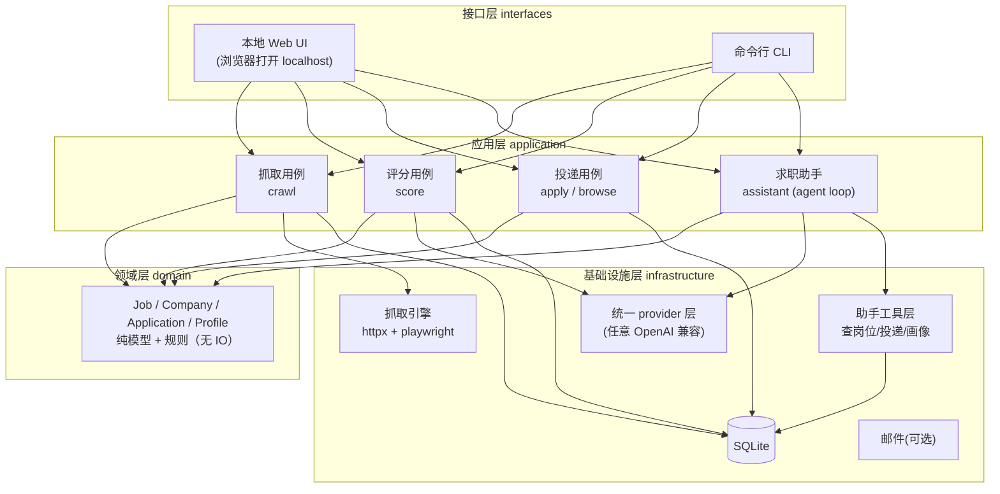

> ⚠️ **本文件是 v1 规划，已被 v2 架构取代。**
> 现行架构见 ARCHITECTURE.md；协作规则见 [../AGENTS.md](../AGENTS.md)。
> 保留本文件是为了记录「当时为什么这样决定」—— 其中的技术选型与目录结构均已变更
> （v2 的主要变化：前后端完全分离、按能力垂直切片、契约先行、删除 SSR 层）。

# Hunter1 —— 开发规划（v0.2 草案）

> **状态：规划稿，尚未实现。** 本文件是全新项目 `hunter1` 的架构与路线基线。
> 生成时间：2026-10-05　｜　v0.2：将 **AI 求职助手**提升为核心功能（v0.1 曾列为待定）
> 基线来源：对旧系统 `D:\RecruitOps` 的实地勘察（含 file:line 可核销）
> 目标读者：项目作者本人 + 后续协作者 / agent

---

## 0. 一句话

hunter1 是一个**轻量、跨平台、零托管**的求职工作台：用户下载后填入**自己的大模型 API Key**
（任意 OpenAI 兼容厂商）即可使用，岗位抓取 → 匹配评分 → **AI 求职助手** → 投递管理全流程本地完成，
安装体积从旧版的 **1.9GB 降到百兆级**。

---

## 1. 需求提炼

### 1.1 目标（用户原话 → 可验证目标）

| 用户原话 | 翻译为可验证目标 |
|---|---|
| 「别人可以正常下载使用，用自己的 API」 | 陌生机器上：下载 → 解压 → 填 API Key → 能抓到岗位并完成评分 |
| 「功能正常完善」 | 覆盖旧系统核心竞争力：多站抓取、匹配评分、岗位库、投递记录 |
| **「要有求职助手」** | 内嵌**聊天式 AI 助手**：能查岗位库、看投递、答疑、给建议（对标旧系统的 codex 助手） |
| **「所有 API 都可以正常使用」** | 任意 OpenAI 兼容端点（DeepSeek / 通义 / 智谱 / Kimi / 硅基流动 / OpenAI / Claude 兼容网关…），**不硬绑任何一家**，且助手与评分共用同一套 provider 配置 |
| 「无与伦比的结构，别人看了会说代码和功能非常厉害」 | 见 §3.1 的**可度量质量属性**（有测试、有类型、有分层、可复现），不是名词堆砌 |
| 「UI 风格从简」 | 本地 Web UI，无桌面原生依赖、无构建链 |
| 「另起一个仓库，推翻前面的结构」 | 全新 git 仓库，架构与旧系统切断，仅**迁移资产**、不继承其结构负债 |

### 1.2 非目标（这一版明确不做）

- ❌ 在线服务 / 多用户 / 托管运营（那需要服务器、成本与隐私合规，是另一个产品）
- ❌ 自动投递（法律与伦理风险，见 §9）
- ❌ 桌面原生观感、移动端

### 1.3 硬约束（吸取旧系统的血泪教训）

1. **安装路径纯英文**——旧系统 PostgreSQL 在中文路径下 `initdb` 必崩（`invalid byte sequence ... 0xc7 0xef`）
2. **无外部运行时依赖**——用户不需要自己装 Python / Node / PostgreSQL / 浏览器
3. **不打包浏览器内核**——复用系统 Chrome/Edge（旧系统已证实可行，见 §3.3）
4. **不硬绑任何 LLM 厂商**——旧系统两处硬绑 DeepSeek（见 §6.1），是本项目要根治的头号问题
5. **核心逻辑可单测**——不依赖网络与模型即可跑（旧系统最大缺口就是核心零测试）

---

## 2. 资产盘点：继承什么、丢弃什么

> 这是本方案的核心判断：**重写的是"外壳与运行时"，迁移的是"抓取资产与数据"。**
> 旧系统 120K 行 Python 里，约 9.6MB 是业务代码，其余 1.9GB 全是第三方运行时——**重写代码改变的是用户体感的 0.5%**。

### 2.1 可迁移资产（旧系统最值钱的部分）

| 资产 | 旧系统位置 | 迁移方式 |
|---|---|---|
| **64 个站点适配器** | `packages/recruitment_core/crawlers/*.py` | 适配新 Crawler 协议后平移；其中 **46 个纯 HTTP、18 个涉及浏览器** |
| **抓取资源治理** | `recruitment_core/resources.py` | 文件锁资源池 + host 冷却 + 指数退避（**精良，直接借鉴**） |
| **领域数据模型** | `packages/storage/models.py` | 19 张表裁剪为 ~8 张核心表；模型注释已支持 SQLite |
| **匹配评分逻辑** | `packages/matching/` | 规则引擎 + LLM 评分，迁移并去品牌化 |
| **多源发现** | `packages/discovery/` | OfferBiu / 腾讯文档等多源发现 |
| **助手工具面设计** | `packages/mcp/server.py` + `.agents/skills/` | 工具清单与技能思路可复用（见 §6.5） |
| **岗位数据（可选）** | 旧实例 DB | 4.6 万岗位可一次性导入新库作为种子 |

### 2.2 明确丢弃（旧系统的过度工程）

| 丢弃项 | 体积/代价 | 原因 |
|---|---|---|
| Electron 壳 + 逐字节哈希校验 | 235MB | 启动脆弱（pyc/未追踪文件即拒启），是"越修越坏"循环的根源 |
| PostgreSQL | 126MB + 1.2GB 数据目录 | 单用户不需要；SQLite 足够 |
| **内置 codex CLI** | 392MB | 它是重量级 agent 运行时，**且自身也硬绑 DeepSeek**（`codex_runtime/config.py` 的 `render_toml()` 过 `official_base()` 校验）。用**轻量自研 agent** 替代（§6.5）——能力不降，体积从 392MB 降到近零 |
| Chromium（playwright 自带） | 615MB | 复用系统浏览器 |
| Node 运行时 | 80MB | 纯 Python 不需要 |
| 常驻看门狗 `monitor_loop` | — | 应用内调度替代，省一个后台常驻进程与一套正则解析文本的脆弱运维 |
| Edge 浏览器桥 `browser_bridge` | — | 简化为 playwright 直接控制 |
| `approval` / `write_audit` 重审批层 | — | 那是给"AI agent 自主写操作"做的安全层，个人工具可简化 |
| `llm-rewrite-proxy` 反代剥离脚本 | — | 它存在的唯一原因是网关不支持 `web_search` 工具类型。hunter1 的助手自研，**不注入该工具**，反代连同这个坑一起消失 |

### 2.3 待定（后续里程碑再评估）

- 简历闪填（浏览器自动填表）
- 邮件同步

> **注**：AI 求职助手**不在此列**——它是核心功能（用户明确要求），路线见 §7 的 M4。

---

## 3. 目标架构

### 3.1 设计原则：把「厉害」翻译成可度量的质量属性

> 「无与伦比的结构」不是架构名词多，而是下面**每一条都有证据**。

| 属性 | 判据（可验证） |
|---|---|
| **可测试** | `domain` + `application` 单元测试覆盖率 ≥ 80%，且**无需网络/数据库**即可运行 |
| **可分层** | `domain` 不 import `infrastructure`；跨层依赖通过 `Protocol`（端口）倒置 |
| **可扩展** | 新增一个招聘站点 = 新增一个文件 + 注册一行；新增一个助手工具 = 新增一个函数，**都不改核心代码** |
| **可移植** | 纯 Python + 无平台特有二进制依赖；Win / macOS / Linux 同一套代码 |
| **可观测** | 结构化日志 + 运行状态可查询；无"静默失败"（旧系统最大痛点） |
| **可复现** | 一条命令：装依赖 → 初始化 → 跑测试 → 打包，全自动 |

### 3.2 分层架构



**依赖方向**：接口层 → 应用层 → 领域层；基础设施层**实现**领域层定义的端口，由应用层注入。
`domain` 与 `infrastructure` **永不互相 import**——这是可测试性的结构保证。

### 3.3 技术选型（每条附核销理由）

| 层 | 选型 | 理由（事实支撑） |
|---|---|---|
| 语言 | **Python 3.12** | 旧系统 64 个适配器是 Python，**可直接迁移**；抓取生态最强；作者可维护 |
| 数据库 | **SQLite (WAL)** | 单文件、零依赖、跨平台；旧模型注释已含 "SQLite-backed regressions"，兼容无忧 |
| Web 框架 | **FastAPI** | 类型化、异步、自带 OpenAPI；复用旧系统后端经验 |
| 前端 | **轻量**（HTMX 或极简 Vue/Alpine） | UI 从简；不引入 Node 构建链 |
| HTTP 抓取 | **httpx + bs4/lxml** | 同旧系统（requests+bs4）迁移成本最低 |
| 浏览器抓取 | **playwright，channel=msedge/chrome** | **复用系统浏览器，不打包 Chromium**。旧系统 `crawlers/base.py` 已实证 `HUNTER_BROWSER_CHANNEL=msedge` 可行 |
| LLM | **httpx 直调 OpenAI 兼容 `/chat/completions`**（统一 provider 层） | 用户自备 key，**不硬绑任何厂商**；覆盖 OpenAI / DeepSeek / 通义 / 智谱 / Kimi / 硅基流动 / Claude 兼容网关等主流端点 |
| 助手运行时 | **自研轻量 agent loop**（非 codex） | 对话 + 工具调用 + 流式；纯 Python 数百行，无 297MB 二进制、不受厂商限制（§6.5） |
| 调度 | **APScheduler 或轻量自研** | 应用内调度，替代旧系统常驻看门狗 |
| 打包 | **PyInstaller / Nuitka** | 各平台单目录/单文件产物，无外部运行时 |

### 3.4 体积对比（目标）

| 组成 | 旧系统 | hunter1（目标） |
|---|---|---|
| Chromium | 615 MB | 0（复用系统浏览器） |
| codex | 392 MB | 0（自研助手替代，见 §6.5） |
| Electron 壳 | 235 MB | 0 |
| Python 运行时 | 215 MB | ~30 MB（打包内嵌） |
| PostgreSQL | 126 MB | 0（SQLite） |
| Node | 80 MB | 0 |
| 应用代码 | 9.6 MB | ~10 MB |
| **合计** | **~1.9 GB** | **~120 MB**（playwright 浏览器可选另装） |

---

## 4. 数据模型（从旧 19 张表裁剪）

**保留的核心表：**

| 表 | 用途 | 来源 |
|---|---|---|
| `companies` | 公司 / 站点 / 适配器绑定 | 旧 `company_snapshots` 裁剪 |
| `jobs` | 岗位（含 `jd_raw`、`match_score`、`first_seen/last_seen`） | 旧 `job_snapshots` |
| `job_analyses` | 评分结果（分项、证据、模型、版本） | 旧 `job_analysis_snapshots` |
| `applications` | 投递记录 + 阶段历史 | 旧 `application_snapshots` |
| `profile` | 候选人画像 / 关键词 | 新设计 |
| `crawl_runs` | 抓取运行记录（进度 / 结果） | 旧 `task_runs` 裁剪 |
| `conversations` | 助手会话 + 消息（**新增，替代旧 codex threads**） | 新设计 |
| `settings` | API 配置、偏好 | 新设计 |
| `schedule_events` | 笔试/面试日程（可选） | 旧 `schedule_event_snapshots` |

**裁掉的表**：`task_runs`/`tool_calls`/`approvals`/`write_audits`/`browser_*`/`automation_*`
（都是旧 agent 审计与浏览器桥的产物）。

---

## 5. 模块划分

```
hunter1/
├── src/hunter1/
│   ├── domain/           纯模型与规则（无 IO 依赖）
│   │   ├── models.py     Job / Company / Application / Profile
│   │   └── rules.py      标题筛查、身份归一、评分规则
│   ├── application/      用例编排
│   │   ├── crawl.py      抓取用例
│   │   ├── score.py      评分用例
│   │   ├── apply.py      投递记录用例
│   │   └── assistant.py  求职助手用例（agent loop：对话 + 工具调度）
│   ├── infrastructure/   外部适配器（实现 domain 端口）
│   │   ├── db/           SQLite 仓储 + 迁移
│   │   ├── llm/          统一 provider 层（任意 OpenAI 兼容端点）
│   │   ├── assistant/    助手运行时（对话循环 / 流式 / 工具注册表）
│   │   ├── crawler/      抓取引擎 + 资源治理
│   │   └── mail/         邮件(可选)
│   ├── tools/            助手可调用的工具（查岗位/投递/画像/日程…）
│   ├── crawlers/         64 个站点适配器（一站点一文件）
│   ├── web/              FastAPI 路由 + 静态页面
│   └── cli.py
├── tests/                单元 + 集成（镜像 src 结构）
├── docs/
├── pyproject.toml
└── README.md
```

---

## 6. 关键技术决策

### 6.1 LLM 接入：统一 provider 层（"所有 API 都能用"的核心）

**问题（旧系统实测）**：`packages/model_policy.py` 的 `official_base()` 只允许 `api.deepseek.com`，
`official_model()` 只允许两个模型；`codex_runtime/config.py` 的 `render_toml()` 也调这两个校验。
**结果：评分链、求职助手、所有 LLM 调用全部硬绑 DeepSeek** —— 用户想换通义/智谱/Kimi 一律不行。

**hunter1 的设计**：

- **统一抽象**：一个 `LLMProvider` 协议，配置项 `base_url` / `api_key` / `model` / `temperature` / `max_tokens`
- **默认走 OpenAI 兼容路径**：`POST {base_url}/chat/completions`（当前主流厂商都提供）
  - 内置常见厂商预设（DeepSeek / 通义 / 智谱 / Kimi / 硅基流动 / OpenAI），用户也可手填任意 `base_url`
- **能力探测而非硬校验**：不再"白名单拒绝"，改为**实际探测**端点（是否支持 streaming / tool calls / json schema），
  不支持则自动降级（见下），并如实告知用户
- **结构化输出降级链**：`response_format: json_schema` → `json_object` → prompt 约束 + 解析重试
  （借鉴旧系统 `matching/client.py` 的 `_structured_schema` 与错误码体系）
- **工具调用降级链**：原生 `tools`/`function_calling` → ReAct 式文本协议（§6.5）
- **成本透明**：记录 token 用量，界面给预算提示（旧系统已有 `input/output_tokens` 字段）

### 6.2 抓取引擎

- **HTTP 优先**，失败或复杂页降级到 playwright
- **资源治理**：延续旧系统 `resources.py` 的 host 冷却 + 并发限流 + 指数退避
- **抗反爬**：UA 轮换、退避；验证码/登录墙识别为"需人工介入"状态（不静默失败）

### 6.3 调度

- **应用内定时**（每日更新），应用关闭则不跑——符合"平时不占资源"
- CLI 可手动触发全量/增量

### 6.4 分发与自更新

- 打包：PyInstaller → 各平台单目录 zip
- 自更新：检查版本清单 → 下载 → 校验 sha256 → 替换（借鉴旧系统思路但**去掉逐字节哈希自校验的脆弱性**）
- 更新源可配（默认 GitHub Release；可改国内镜像）

### 6.5 求职助手（核心功能）

**旧系统怎么做**（实测）：`codex` app-server（**297MB 独立二进制**）作为子进程 → `apps/api/codex_bff.py`
包成 12 个 REST 端点（threads / turns / stream / events）→ `config.toml` 挂 MCP server 提供工具 →
`.agents/skills/` 5 个技能文件（application-status / crawler-operations / job-intelligence /
recruitment-mail / schedule-management）。工具面见 `packages/mcp/server.py`：`search_jobs` /
`job_detail` / `company_coverage` / `application_query` / `application_status_review` /
`today_schedule` / `recruitment_mail_*` 等。

**hunter1 怎么做**：**自研轻量 agent loop**，不内嵌 codex。

```
用户消息
  → 组装上下文（系统提示 + 会话历史 + 工具定义 + 当前岗位/画像摘要）
  → LLM 调用（统一 provider 层）
  → 若返回工具调用 → 执行 → 结果回灌 → 回到 LLM（循环）
  → 流式输出最终回复
```

| 组件 | 设计 |
|---|---|
| **对话循环** | 一个 `while` 循环 + 工具调用（tool use），带最大轮次与超时保护 |
| **工具注册表** | 每个工具 = 一个带类型标注的函数 + JSON schema（FastAPI/pydantic 风格的自动生成） |
| **首版工具集** | `search_jobs` / `job_detail` / `application_query` / `profile_read` / `today_schedule`（从旧 MCP 工具面裁剪，去掉运维类） |
| **流式** | SSE（`text/event-stream`）推给前端 |
| **会话持久化** | `conversations` / `conversation_messages` 表（替代旧 codex threads） |
| **工具能力降级** | 若用户 API 不支持原生 function calling → 退化为 ReAct 文本协议（`Thought/Action/Observation`） |

**为什么自研而不是内嵌 codex**：

| 维度 | codex | 自研 |
|---|---|---|
| 体积 | 297MB | 几 KB |
| 厂商支持 | 自身硬绑 DeepSeek（`render_toml` 过校验） | 任意 OpenAI 兼容 |
| 可控性 | 受 codex 版本行为约束（如注入 `web_search` 导致 400，被迫加反代） | 完全自主 |
| 可测试 | 黑盒二进制 | 纯函数可单测，fake LLM 可离线跑 |

> ⚠️ **诚实提示**：自研 agent 的**工具调用鲁棒性**需要真机打磨——不同厂商的 function calling 质量差异很大。
> 这是本方案最大的未知数之一，见 §10 反证第 6 条。

---

## 7. 分阶段路线

> 每个阶段独立可验收，任何一步失败都不影响已完成部分。**旧系统继续运行，不中断你的秋招。**

### M0 · 地基（约 3-5 天）
- 仓库、目录分层、`pyproject.toml`、CI（lint + typecheck + test）
- 验收：`git clone → 一条命令 → 测试全绿（0 用例也算达标，重点是管道通）`

### M1 · 数据层（约 3-5 天）
- SQLite schema + 迁移 + 仓储实现 + 单元测试
- 验收：`pytest tests/infrastructure/db` 全绿；可导入旧 4.6 万岗位（可选）

### M2 · 抓取（约 1-2 周）
- Crawler 协议 + 资源治理 + 迁移 46 个纯 HTTP 适配器（先做高价值站点）
- 验收：对 ≥5 个真实站点跑通，产出结构化岗位；有 fake 站点单测

### M3 · 评分 + 统一 provider 层（约 1 周）
- **统一 LLM provider 层**（§6.1）+ 评分用例 + 规则引擎迁移
- 验收：**同一套配置**分别接 ≥3 家厂商（如 DeepSeek / 通义 / 硅基流动）都能出分；
  有 fake LLM 单测覆盖分支与降级链
- ⚠️ 这是"所有 API 都能用"的落地关口，必须先于助手完成

### M4 · 求职助手（约 1-2 周）
- agent loop + 工具注册表 + 首版工具集 + 会话持久化 + 流式（§6.5）
- 验收：CLI/接口下能完成"查岗位 → 看详情 → 问建议"多轮对话；工具调用走通；
  有 fake LLM 的离线单测；**换一家 API 仍可用**

### M5 · Web UI（约 1 周）
- 岗位库 / 配置页（填 API Key + 测试连接）/ 投递记录 / 抓取进度 / **助手对话页**
- 验收：浏览器打开 localhost 全流程可用；无 JS 构建链

### M6 · 打包分发（约 1 周）
- PyInstaller 打包 + 自更新 + 首次运行引导
- 验收：**陌生机器**上解压即用（这是"能给别人用"的最终判据）

### M7 · 进阶（按需）
- 浏览器适配器（18 个 render 站点）、简历闪填、邮件同步

---

## 8. 质量门槛（CI 每次提交必过）

| 关卡 | 工具 | 门槛 |
|---|---|---|
| 格式 | ruff format | 无 diff |
| 静态检查 | ruff check | 0 警告 |
| 类型 | pyright / mypy | 0 错误（strict 逐步收紧） |
| 测试 | pytest | 全绿；核心覆盖率 ≥ 80% |
| 打包 | 冒烟 | 能构建出可运行产物 |

---

## 9. 风险与开放问题

| 风险 | 影响 | 缓解 |
|---|---|---|
| **抓取与自动投递的法律/合规风险** | 给别人用可能违反站点条款 | 这一版**不做自动投递**；仅抓取公开岗位信息；README 写明合规提示 |
| **适配器迁移的行为回归** | 迁移后抓取结果与旧系统不一致 | 先给每个迁移的适配器建**基线测试**（用旧系统的真实输出做黄金样本） |
| **SQLite 并发写** | 抓取+评分同时写可能锁冲突 | WAL 模式 + 单写者队列；若实测不够再评估 |
| **厂商 API 能力差异大** | 部分厂商不支持 function calling / json schema | 能力探测 + 分级降级链（§6.1/§6.5），并如实提示用户 |
| **自研 agent 鲁棒性** | 工具调用可能不稳定 | 首版保守工具集 + 充分离线单测 + 明确失败提示（不静默） |
| **跨平台打包工作量** | 三平台各自构建、各自调试 | M6 先做 Windows，Mac/Linux 随后 |
| **系统浏览器缺失** | 18 个 render 适配器不可用 | 检测并引导安装；纯 HTTP 适配器不受影响 |
| **用户低估 API 成本** | 用户跑一次全量花掉额度 | 界面预算提示 + 小样本试跑 |

---

## 10. 反证：本方案可能错在哪（诚实自问）

1. **如果目标用户没有 Chrome/Edge** —— 18 个浏览器适配器直接不可用。缓解：优先迁移 46 个纯 HTTP 适配器。
2. **如果"追求无与伦比"变成了过度设计** —— 这正是旧系统 1.9GB 的病根。
   **本项目的成败判据不是"架构多漂亮"，而是"陌生机器上装完就能用"。** 若二者冲突，选后者。
3. **如果 SQLite 撑不住** —— 需回退 PG，但会重新引入 126MB 与运维复杂度。
4. **如果低估适配器迁移成本** —— 64 个适配器的行为一致性验证是最大的隐藏工作量。
5. **分发仍是门槛** —— 即使 120MB，让非技术用户完成"下载→解压→填 key"仍有流失；真正的零门槛需要在线服务（即丙类）。
6. **如果自研助手做不过 codex** —— codex 是成熟 agent 产品，自研首版在工具调用鲁棒性、
   长上下文管理、错误恢复上大概率不如它。**缓解**：先做保守工具集（只读查询，不做写操作），
   并把"助手不可用"设计成**优雅降级**而非功能缺失——用户仍能用 Web UI 完成全部核心操作。

---

## 附：本规划的可核销依据

| 结论 | 依据 |
|---|---|
| 64 个适配器、46 纯 HTTP / 18 涉及浏览器 | `D:\RecruitOps\resources\desktop-runtime\app\packages\recruitment_core\crawlers\` |
| 适配器接口 `BaseCrawler.fetch() -> list[dict]` | `crawlers\base.py` |
| 可复用系统 Edge | `crawlers\base.py` 的 `launch_browser`（`HUNTER_BROWSER_CHANNEL=msedge`） |
| 资源治理精良 | `recruitment_core\resources.py`（FileLease/ResourcePool/cooldown） |
| 数据模型兼容 SQLite | `packages\storage\models.py` 注释 "including SQLite-backed regressions" |
| 旧系统体积构成 | `du -sh resources/desktop-runtime/*/`：chromium 615M / codex 392M / python 215M / postgres 126M / node 80M |
| **求职助手 = codex app-server + BFF 12 端点 + MCP 工具 + 5 技能** | `apps\api\codex_bff.py`、`packages\codex_runtime\`、`.agents\skills\`、`packages\mcp\server.py` |
| **助手自身也硬绑 DeepSeek** | `packages\codex_runtime\config.py` 的 `render_toml()` 调 `official_base()`/`official_model()` |
| **LLM 政策只允许 DeepSeek** | `packages\model_policy.py`（`official_base` 白名单 `api.deepseek.com`，模型仅两个） |
| 助手现有工具面 | `packages\mcp\server.py`：`search_jobs` / `job_detail` / `company_coverage` / `application_query` / `application_status_review` / `today_schedule` / `recruitment_mail_*` |
| web_search 反代是为绕开网关限制 | `llm-rewrite-proxy\proxy.py`（剥离 codex 注入的 `{"type":"web_search"}` 工具） |
| 核心零测试 | 全仓 `find` 无 `packages/` `apps/` 下的 `test_*.py` |
